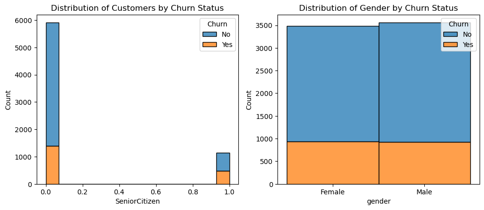

# **Churn Rates and Root Causes**

##**Background**

Churn analysis is a process used by businesses to understand and manage customer attrition, or "churn".  Churn analysis helps to identify pain points throughout the customer journey.  It involves examining why customers stop using a product or service and identifying patterns or factors that contribute to their decision to leave.  Understanding those pain points then opens avenues to improve products, services and communication.

This project aims to analyze customer churn rates and identify the underlying causes.

##**Data Description**

The data used in this project includes:
The dataset contains 7043 rows and 21 columns.
Customer transaction history:  Contains information on customer purchases, interactions, and service usage
Customer demographics:  Includes detaisl such as age, gender, marital status, 

The data files are located in the 'data/' directory.

##Methodology

1. Data Collection:  Collect and preprocess data.
2. Churn Rate Calculation:  Compute churn rates using historical data.
3. Root Cause Analysis:  Apply statistical and machine learning techniques to identify factors contributing to churn.
4. Predictive Modeling:  Develop a model to predict customer churn.

For detailed information on each method, reference the notebooks in the 'notebooks/' directory.

##Results

The results section includes:

- Churn Rate Analysis:  Summary of churn rates and trends.
- Root Cause Insights:  Key factors contributing to churn.
- Segmentation Outcomes:  Customer segments at high risk of churn.
- Predictive Model Performance:  Metrics and evaluation of churn prediction model

##**Describing Data**

The dataset used in this project includes:

 - Customer who left within a month, a year, and two years.
 - The services each customer signed up for:  phone, multiple lines, internet, online seurity, online backup, device protection, tech support, and streaming TV and movies. 
 - Customer account information:  how long a person was a customer, contract payment method, paperless billing, monthly charges, and total charges. 
 - Demographic info about customers:  gender, age range, and if they have partners and dependents.

##**Data Visualization**

Figure 1 shows bar graph of distribution by customer contracts.

    

    Figure 1.  Bar graph of customer contracts

Figure 2 shows bar graph of distibution by tenure - churn, contracts-churn, and charges-churn.

    

    Figure 2.  Bar graph of tenure - churn, contracts-churn, and charges-churn

Figure 3 shows correlation heatmap.

    

    Figure 2.  Correlation Heatmap

##**Future Directions**

##**References**
